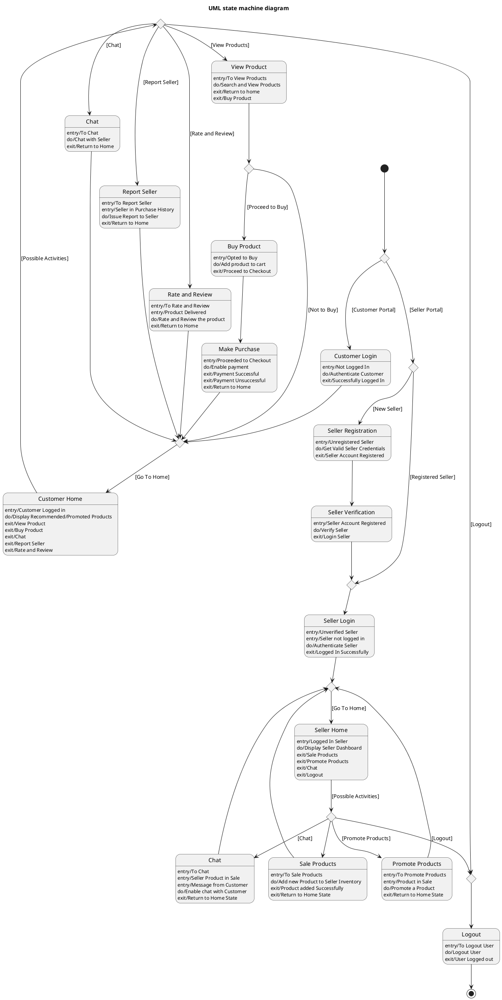

# Online Marketplace — Polished Requirement Specification

## Requirement

Online Marketplace — Polished Requirement Specification

Functional Requirements
1. The system shall require the user to provide their details and create an account before they can join as a seller or customer.
2. The system shall allow the user to sign in and access their workspace after completing registration and verification.
3. The system shall enable the seller to add new products to the marketplace.
4. The system shall allow the seller to promote existing products on the platform.
5. The system shall enable the seller to communicate with customers through the platform.
6. The system shall allow the seller to leave the platform at any time, leading to logging out.
7. The system shall require the customer to sign in and access their personal dashboard upon joining.
8. The system shall allow the customer to explore products on the platform.
9. The system shall enable the customer to search and view available products during browsing.
10. The system shall allow the customer to either stop browsing or proceed with a purchase after viewing products.
11. The system shall add the selected product to the customer's cart and allow them to proceed to checkout if they decide to make a purchase.
12. The system shall handle payment during the checkout process.
13. The system shall allow the customer to communicate with a seller during their session.
14. The system shall enable the customer to report a seller if needed, based on previous interactions.
15. The system shall allow the customer to rate and review products after receiving them.
16. The system shall allow both the seller and the customer to log out by choosing to leave the platform at any time.

## Reference PlantUML

