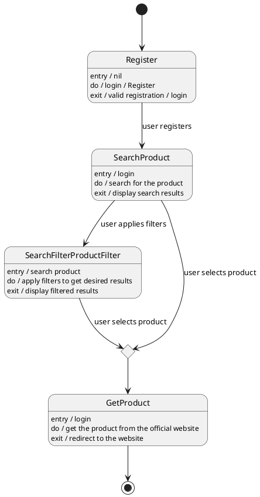

# Product Recommendation — Polished Requirement Specification

## Requirement

Product Recommendation — Polished Requirement Specification

Functional Requirements
1. The system shall allow users to register or sign in to access the platform.
2. The system shall enable users to search for products after they have registered or logged in.
3. The system shall display matching product results based on the user's search query.
4. The system shall allow users to apply filters to refine their search results.
5. The system shall update the displayed product results based on the applied filters.
6. The system shall allow users to select a product from search or filtered results.
7. The system shall redirect the user to the official website of the selected product upon selection.

## Reference PlantUML

