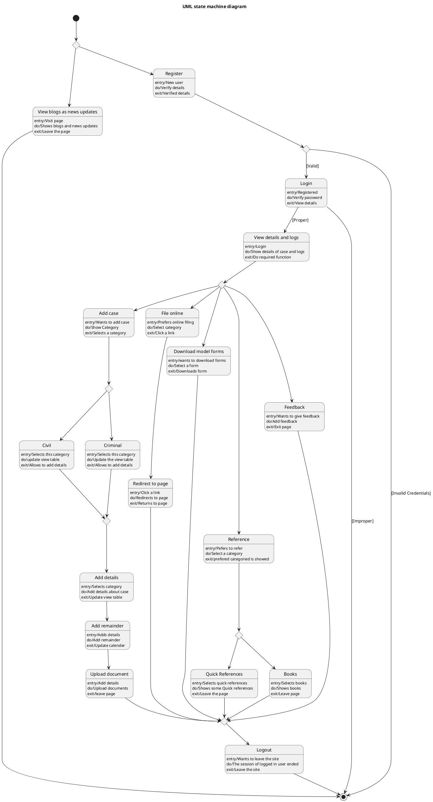

# Advocate Diary — Polished Requirement Specification

## Requirement

Advocate Diary — Polished Requirement Specification

Functional Requirements
1. The system shall allow users to explore blogs and news updates.
2. The system shall permit users to leave at any time after viewing blogs and news updates.
3. The system shall enable users to create an account by providing their details.
4. The system shall check the provided details during account creation.
5. The system shall prevent users from proceeding if the provided details are incorrect during account creation.
6. The system shall allow users to sign in using a password after creating an account.
7. The system shall check the entered password during sign-in.
8. The system shall allow users to add a new case after signing in.
9. The system shall require users to select a category ( civil or criminal ) when adding a new case.
10. The system shall allow users to enter details for the selected category when adding a new case.
11. The system shall enable users to set reminders after entering case details.
12. The system shall allow users to upload related documents for their cases.
13. The system shall enable users to file something online after signing in.
14. The system shall allow users to download model forms after signing in.
15. The system shall enable users to view references ( quick or book )after signing in.
16. The system shall allow users to provide feedback after signing in.
17. The system shall permit users to leave the system after completing their tasks.

## Reference PlantUML

