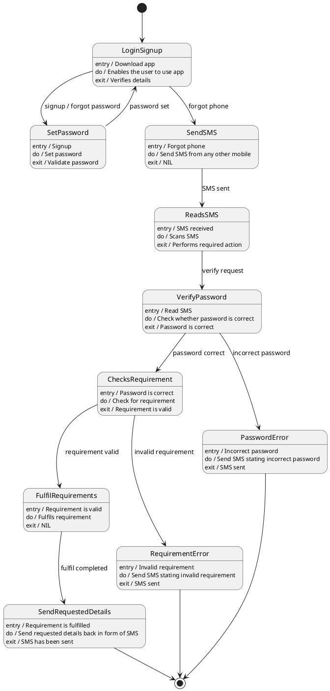

# My Helper — Polished Requirement Specification

## Requirement

My Helper — Polished Requirement Specification

Functional Requirements
1. The system shall allow new users or users who have forgotten their password to create a new password.
2. The system shall enable the user to continue using the app after setting a correct password.
3. The system shall allow users to send messages from another mobile phone if they cannot use their own phone.
4. The system shall read incoming messages to understand the user's needs.
5. The system shall check the user’s password for correctness and inform the user if it is wrong.
6. The system shall ensure that if the user's password is correct, the system shall check the user’s request.
7. The system shall support for valid requests, the system shall complete them and send back required details to the user.
8. The system shall support for invalid requests, the system shall inform the user that the request cannot be accepted.

## Reference PlantUML

