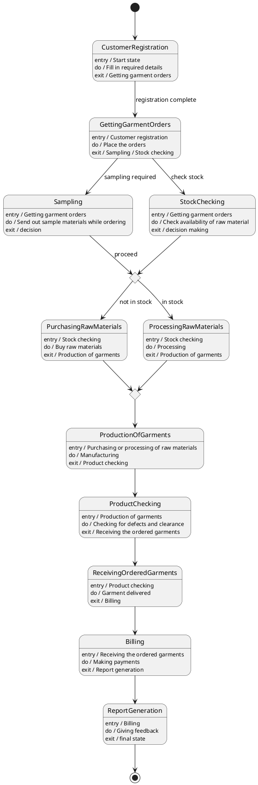

# Textile — Polished Requirement Specification

## Requirement

Textile — Polished Requirement Specification

Functional Requirements
1. The system shall allow customers to create an account by filling in required details.
2. The system shall enable customers to place orders for garments once they are registered.
3. The system shall send out sample materials if a customer needs them after placing an order.
4. The system shall review the availability of raw materials for orders that require stock checking.
5. The system shall purchase raw materials if they are not available after stock checking.
6. The system shall process raw materials if they are already available.
7. The system shall begin garment production once raw materials are ready, either through purchasing or processing.
8. The system shall conduct a defect check on the produced garments.
9. The system shall deliver the finished garments to the customer if all checks pass.
10. The system shall complete billing and payment processes after delivering the garments.
11. The system shall generate a report along with feedback at the end of the process.

## Reference PlantUML

