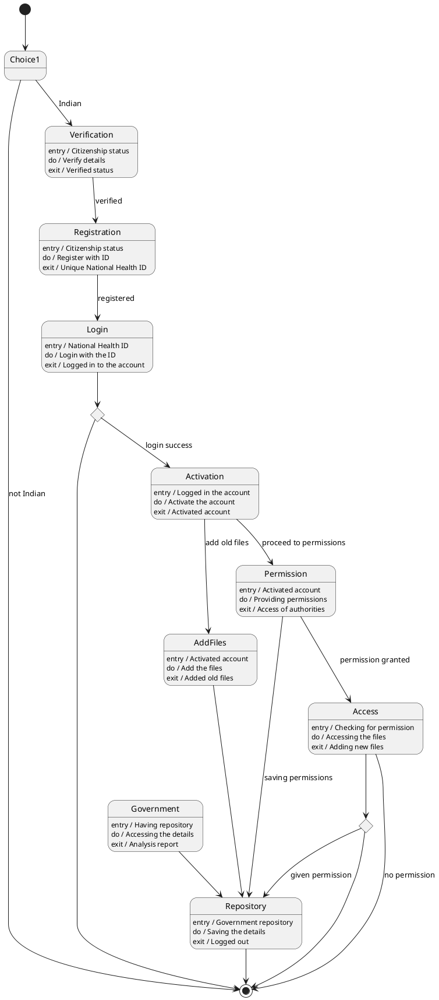

# National Health Id — Polished Requirement Specification

## Requirement

National Health Id — Polished Requirement Specification

Functional Requirements
1. The system shall check if a person is an Indian citizen.
2. The system shall verify the details of an Indian citizen.
3. The system shall generate a unique health ID for registered Indian citizens.
4. The system shall activate an account upon successful login.
5. The system shall support after activation, the system shall allow users to either add old files or set permissions.
6. The system shall store added old files.
7. The system shall provide access to relevant authorities based on set permissions.
8. The system shall allow adding new files when permission is granted.
9. The system shall store all the information provided by users.
10. The system shall allow the government to access stored data to view details and prepare reports.

## Reference PlantUML

