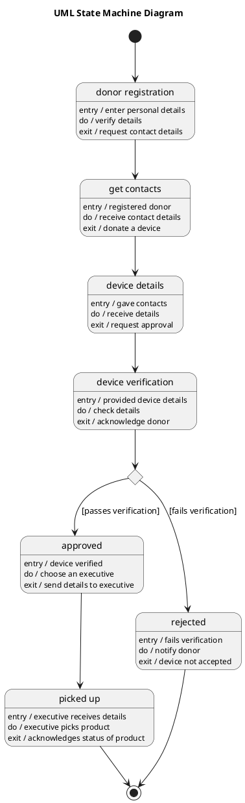

# Device Handout — Polished Requirement Specification

## Requirement

Device Handout — Polished Requirement Specification

Functional Requirements
1. The system shall collect personal details from a donor during registration.
2. The system shall check the entered personal details after registration.
3. The system shall collect contact information from a donor after verifying their personal details.
4. The system shall allow donors to share details about the device they want to donate.
5. The system shall review the shared device details.
6. The system shall support if a device meets the requirements, the system shall accept it.
7. The system shall assign an executive to handle the accepted device.
8. The system shall confirm the status of the accepted device by the executive.
9. The system shall support if a device does not meet the requirements, the system shall inform the donor that it cannot be accepted.

## Reference PlantUML

