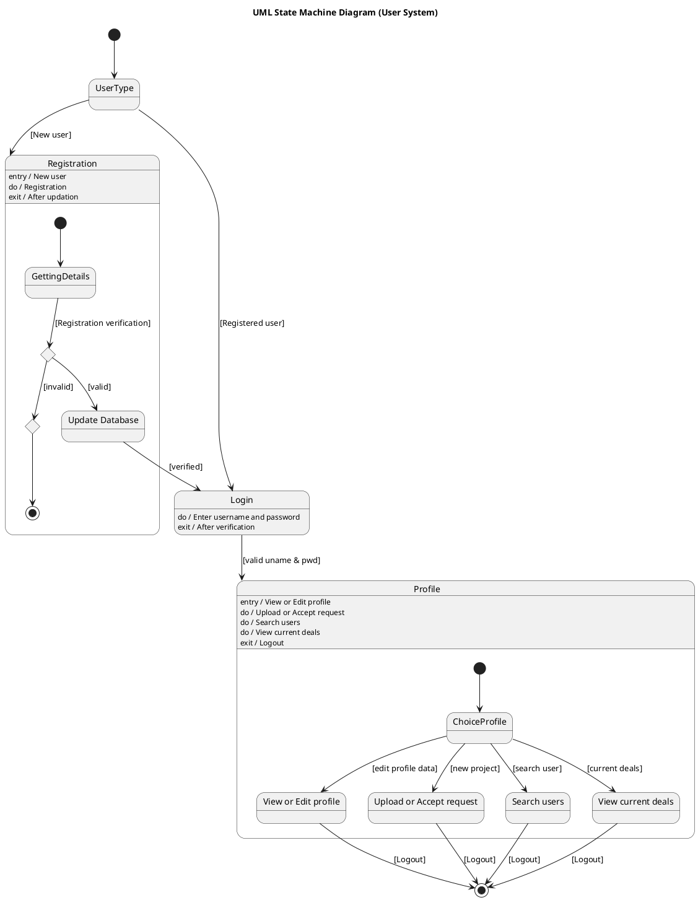

# Business Process Outsourcing Bpo Management System Scenario 1 — Polished Requirement Specification

## Requirement

Business Process Outsourcing Bpo Management System Scenario 1 — Polished Requirement Specification

Functional Requirements
1. The system shall prompt the user to choose whether they are a new user or an already registered user.
2. The system shall require new users to enter their details for registration and end the process if the details are invalid.
3. The system shall save the user's information after a successful registration and allow them to log in.
4. The system shall allow registered users to directly log in by entering their username and password and continue if the login is successful.
5. The system shall allow users to manage their profile after logging in, which includes editing details, uploading or accepting requests, searching for other users, or viewing current deals.
6. The system shall require users to log out after they complete any action.

## Reference PlantUML

