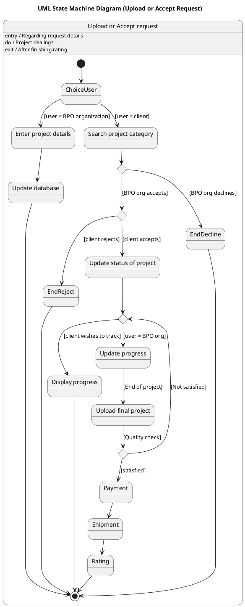

# Business Process Outsourcing Bpo Management System Scenario 3 — Polished Requirement Specification

## Requirement

Business Process Outsourcing Bpo Management System Scenario 3 — Polished Requirement Specification

Functional Requirements
1. The system shall allow a user to upload a new request.
2. The system shall enable a BPO organization to save the details of a project.
3. The system shall allow a client to search for a suitable project category.
4. The system shall enable an BPO organization to accept or decline a request from a client.
5. The system shall allow a client to decide whether to proceed with an accepted project or reject it.
6. The system shall update the project status after acceptance by both parties.
7. The system shall allow a client to track the progress of a project.
8. The system shall enable an BPO organization to update the progress of a project.
9. The system shall upload a final project once work is completed.
10. The system shall perform a quality check on the final project.
11. The system shall restart the process if a client is unsatisfied with the final project.
12. The system shall make payment if the client is satisfied with the final project.
13. The system shall deliver the project after payment.
14. The system shall allow a client to provide a rating for the completed project.

## Reference PlantUML

