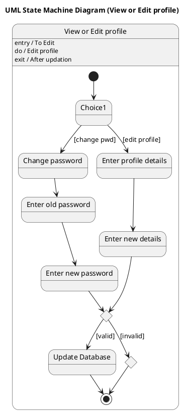

# Business Process Outsourcing Bpo Management System Scenario 4 — Polished Requirement Specification

## Requirement

Business Process Outsourcing Bpo Management System Scenario 4 — Polished Requirement Specification

Functional Requirements
1. The system shall allow the user to change their password by entering their old password and a new one.
2. The system shall allow the user to update their profile details by entering new information.
3. The system shall validate the entered information after a password change or profile update.
4. The system shall save the changes if the validation passes.

## Reference PlantUML

