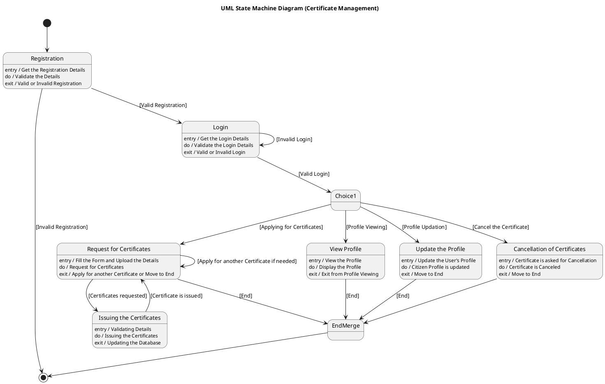

# E Province — Polished Requirement Specification

## Requirement

E Province — Polished Requirement Specification

Functional Requirements
1. The system shall register a new user.
2. The system shall end the process if registration details are not accepted.
3. The system shall allow a user to log in after successful registration.
4. The system shall provide multiple login attempts if the details are incorrect.
5. The system shall allow the user to cancel a certificate after logging in.
6. The system shall allow the user to apply for certificates after logging in.
7. The system shall allow the user to view their profile after logging in.
8. The system shall allow the user to update their profile after logging in.
9. The system shall require the user to fill in the form and upload required details when applying for certificates.
10. The system shall allow users to apply for more certificates as needed.
11. The system shall allow the user to continue applying or finish once a certificate request is processed.

## Reference PlantUML

