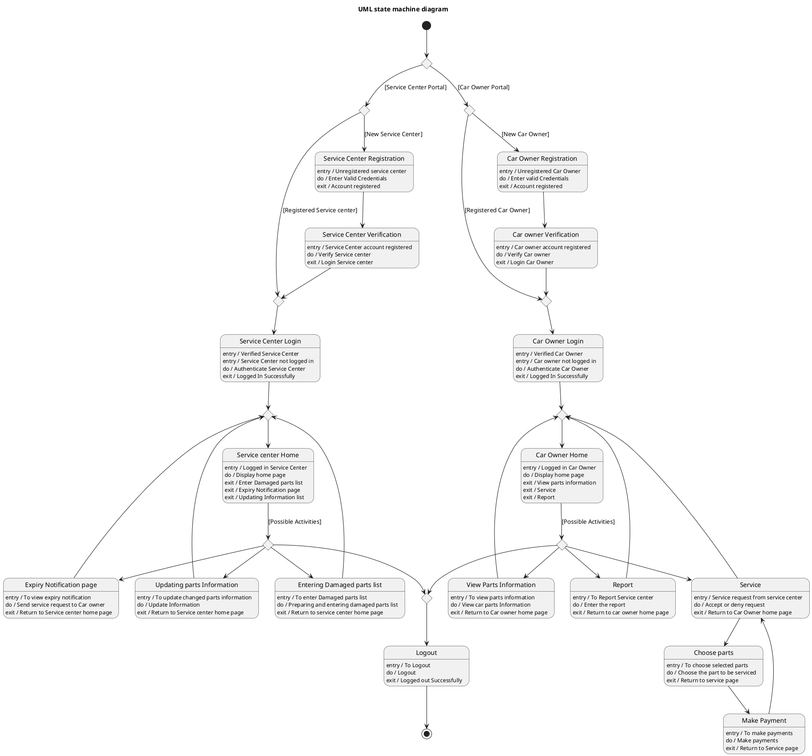

# Car Care — Polished Requirement Specification

## Requirement

Car Care — Polished Requirement Specification

Functional Requirements
1. The system shall allow users to choose whether they are using the service center side or the car owner side.
2. The system shall allow service center users to register or log in if already registered.
3. The system shall allow service center users to enter damaged parts, update parts information, or send expiry-related notifications after logging in.
4. The system shall allow service center users to log out after finishing any of the above activities.
5. The system shall allow car owner users to register or log in.
6. The system shall allow car owners to view parts information, request or respond to services, or report a service center after logging in.
7. The system shall allow car owners to select required parts and make a payment when choosing a service.
8. The system shall allow car owners to log out after completing their activities.

## Reference PlantUML

