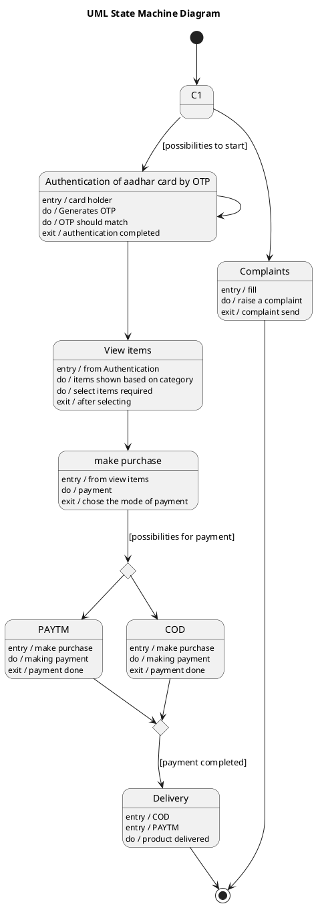

# E Ration Shop — Polished Requirement Specification

## Requirement

E Ration Shop — Polished Requirement Specification

Functional Requirements
1. The system shall allow users to raise a complaint directly.
2. The system shall end the process after a user raises a complaint.
3. The system shall allow users to authenticate their identity using an OTP.
4. The system shall allow multiple attempts for OTP authentication if the initial attempt fails.
5. The system shall enable users to view items based on different categories once they are successfully authenticated.
6. The system shall allow users to select items for purchase after viewing them.
7. The system shall provide users with the option to pay either through an online method or by cash on delivery.
8. The system shall deliver the product after the payment is completed.

## Reference PlantUML

