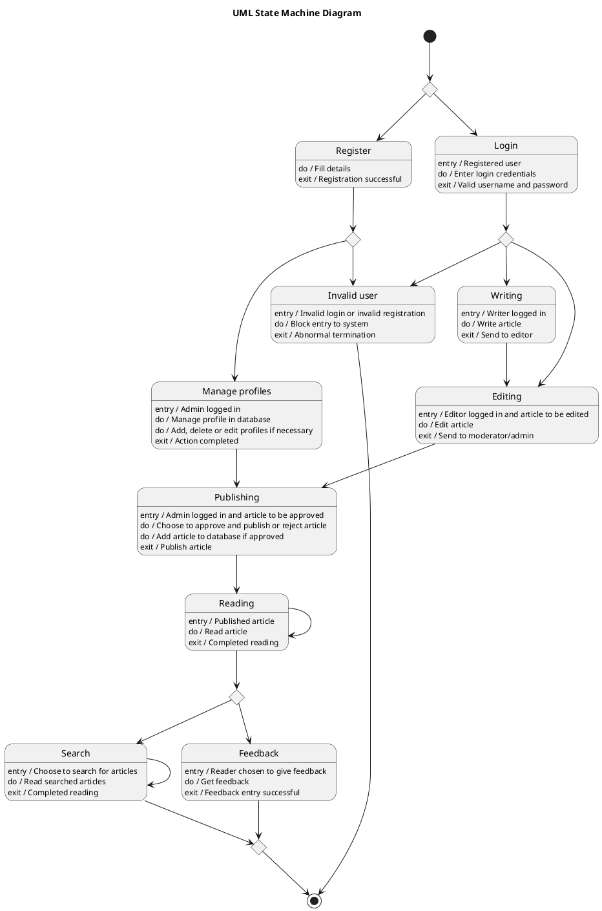

# For Online College Magazine System — Polished Requirement Specification

## Requirement

For Online College Magazine System — Polished Requirement Specification

Functional Requirements
1. The system shall require a person to either create an account or log in.
2. The system shall allow admins to add, edit, or remove user profiles.
3. The system shall enable admins to review articles and decide on their publication or rejection.
4. The system shall permit content creators to write articles and send them for editing.
5. The system shall have editors review articles from content creators and pass them for approval.
6. The system shall restrict access if a login attempt is invalid.
7. The system shall make published articles available for user reading.
8. The system shall allow users to search for more articles during their reading session.
9. The system shall enable users to provide feedback after reading articles.
10. The system shall end when users complete their search or provide feedback.

## Reference PlantUML

