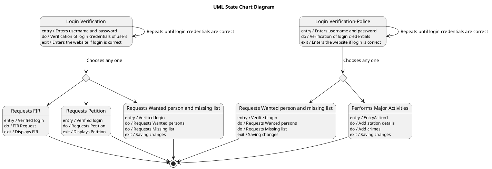

# Crime Bureau — Polished Requirement Specification

## Requirement

Crime Bureau — Polished Requirement Specification

Functional Requirements
1. The system shall allow a user to log in by entering their username and password.
2. The system shall allow the user to try again if the login details are incorrect until successful login.
3. The system shall allow the user to choose between requesting an FIR, requesting a petition, or viewing the list of wanted and missing persons after login.
4. The system shall display the requested information once the user selects an option.
5. The system shall allow a police user to log in by entering their username and password.
6. The system shall allow the police user to try again if the login details are incorrect until successful login.
7. The system shall allow the police user to view the list of wanted and missing persons or perform major activities such as adding station details and crime records after login.

## Reference PlantUML

