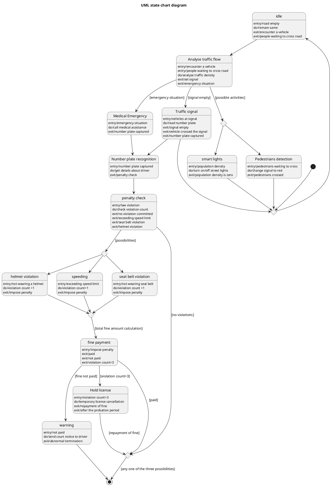

# Smart Traffic Management System — Polished Requirement Specification

## Requirement

Smart Traffic Management System — Polished Requirement Specification

Functional Requirements
1. The system shall monitor traffic conditions whenever vehicles are on the road or pedestrians are waiting to cross.
2. The system shall control street lights according to traffic conditions.
3. The system shall manage traffic signals in response to detected situations.
4. The system shall capture vehicle numbers and check driver details when a vehicle passes through a signal or an emergency is identified.
5. The system shall verify if traffic rules (overspeeding, not wearing a seat belt, or not wearing a helmet) have been broken after capturing vehicle numbers and checking driver details.
6. The system shall support if no traffic rule has been broken, the system shall end the process.
7. The system shall ensure that if a traffic rule is broken, the system shall record the violation and issue a fine.
8. The system shall ensure that if the fine is paid, the system shall complete the process.
9. The system shall ensure that if the fine is not paid, the system shall send a warning.
10. The system shall ensure that if the number of violations exceeds the allowed limit, the system shall temporarily hold the driver's license until the fine is cleared or the probation period is over.

## Reference PlantUML

