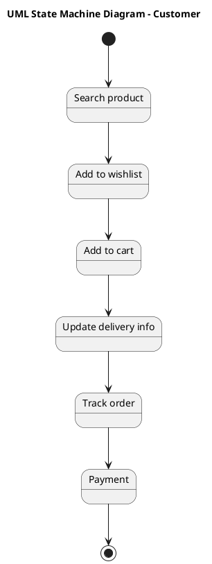

# Online Pharmacy Management System Scenario 1 — Polished Requirement Specification

## Requirement

Online Pharmacy Management System Scenario 1 — Polished Requirement Specification

Functional Requirements
1. The system shall allow customers to search for products.
2. The system shall allow customers to add products to their wishlist.
3. The system shall allow customers to move items from their wishlist to the shopping cart.
4. The system shall allow customers to provide or update delivery details for items in the cart.
5. The system shall allow customers to place orders after providing delivery details.
6. The system shall enable customers to track their orders after placement.
7. The system shall allow customers to complete payments for their orders.

## Reference PlantUML

