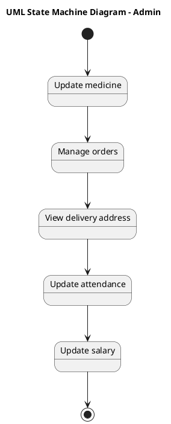

# Online Pharmacy Management System Scenario 2 — Polished Requirement Specification

## Requirement

Online Pharmacy Management System Scenario 2 — Polished Requirement Specification

Functional Requirements
1. The system shall allow admins to update medicine details.
2. The system shall allow admins to manage customer orders.
3. The system shall allow admins to view delivery addresses related to customer orders.
4. The system shall allow admins to update attendance records.
5. The system shall allow admins to update salary details.

## Reference PlantUML

