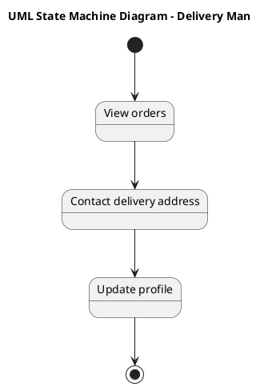

# Online Pharmacy Management System Scenario 3 — Polished Requirement Specification

## Requirement

Online Pharmacy Management System Scenario 3 — Polished Requirement Specification

Functional Requirements
1. The system shall display a list of available orders to the delivery person.
2. The system shall allow the delivery person to contact the delivery address for coordination.
3. The system shall enable the delivery person to update their profile as needed.

## Reference PlantUML

