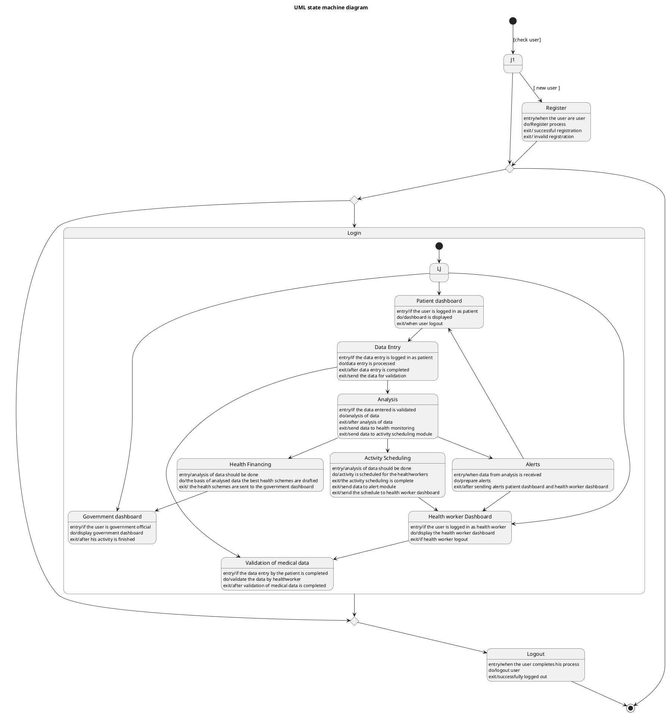

# Equihealth — Polished Requirement Specification

## Requirement

Equihealth — Polished Requirement Specification

Functional Requirements
1. The system shall allow new users to create an account.
2. The system shall check if a user's registration is completed before allowing them to sign in.
3. The system shall display different dashboards based on the user type after they sign in (patient, health worker, or government official).
4. The system shall show a patient dashboard to users who enter as patients, allowing them to provide medical information.
5. The system shall allow health workers to check and use the medical information provided by patients for further analysis.
6. The system shall prepare alerts based on the analyzed information, which may be sent to either the patient or the health worker.
7. The system shall show planned activities (from the analysis) to health workers.
8. The system shall display health planning results (from the analysis) to government officials.
9. The system shall allow users to log out after they complete their tasks.

## Reference PlantUML

