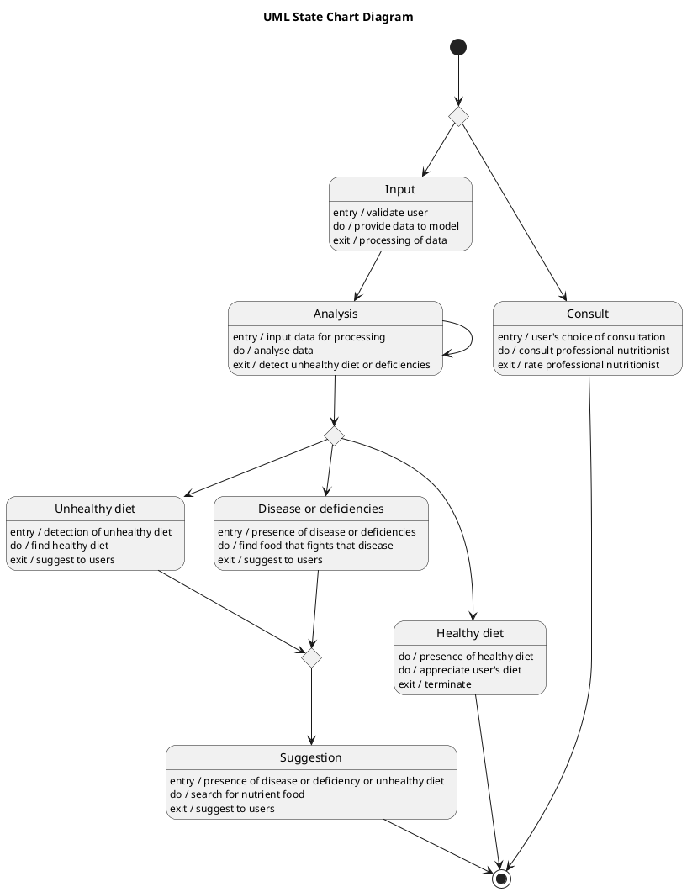

# Diet Care — Polished Requirement Specification

## Requirement

Diet Care — Polished Requirement Specification

Functional Requirements
1. The system shall allow users to choose between entering their information or consulting a professional nutritionist.
2. The system shall enable users who choose consultation to speak with a nutritionist and rate the experience afterward.
3. The system shall analyze the information entered by the user.
4. The system shall identify if the user has an unhealthy diet, a disease or deficiency, or follows a healthy diet based on the analyzed information.
5. The system shall provide suitable food suggestions if the analysis indicates an unhealthy diet.
6. The system shall provide food suggestions to help with the identified disease or deficiency if found during the analysis.
7. The system shall appreciate users for following a healthy diet if their diet is already healthy.

## Reference PlantUML

