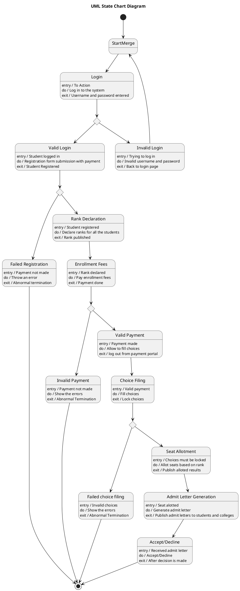

# Student Counselling Management System — Polished Requirement Specification

## Requirement

Student Counselling Management System — Polished Requirement Specification

Functional Requirements
1. The system shall allow a student to log in.
2. The system shall prompt the student to try again if login details are incorrect.
3. The system shall proceed with registration and payment upon a successful login.
4. The system shall end there if the registration payment is not completed.
5. The system shall register the student and declare ranks if the registration payment is completed.
6. The system shall allow the student to pay enrollment fees after rank declaration.
7. The system shall end there if the payment for enrollment fees is not successful.
8. The system shall allow the student to fill in their choices if the payment for enrollment fees is successful.
9. The system shall lock the choices and allocate seats based on rank if they are correct.
10. The system shall generate an admit letter once a seat is allotted.
11. The system shall allow the student to accept or decline the admit letter.

## Reference PlantUML

