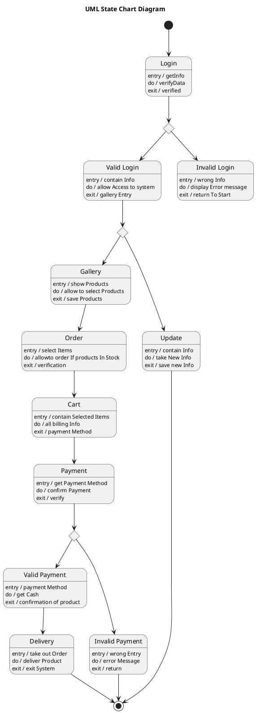

# Art Gallery Mananement System — Polished Requirement Specification

## Requirement

Art Gallery Mananement System — Polished Requirement Specification

Functional Requirements
1. The system shall verify login credentials upon submission.
2. The system shall display an error message and prevent further interaction if login details are incorrect.
3. The system shall allow users to view products or update their information after a successful login.
4. The system shall allow users to select items and place an order when viewing products.
5. The system shall add selected product items to the order and prepare billing details.
6. The system shall allow users to choose a payment method after adding products to their order.
7. The system shall process and deliver the order if the payment is successful.
8. The system shall end the process without further action if the payment fails.
9. The system shall allow users to save updated information after entering new details.

## Reference PlantUML

