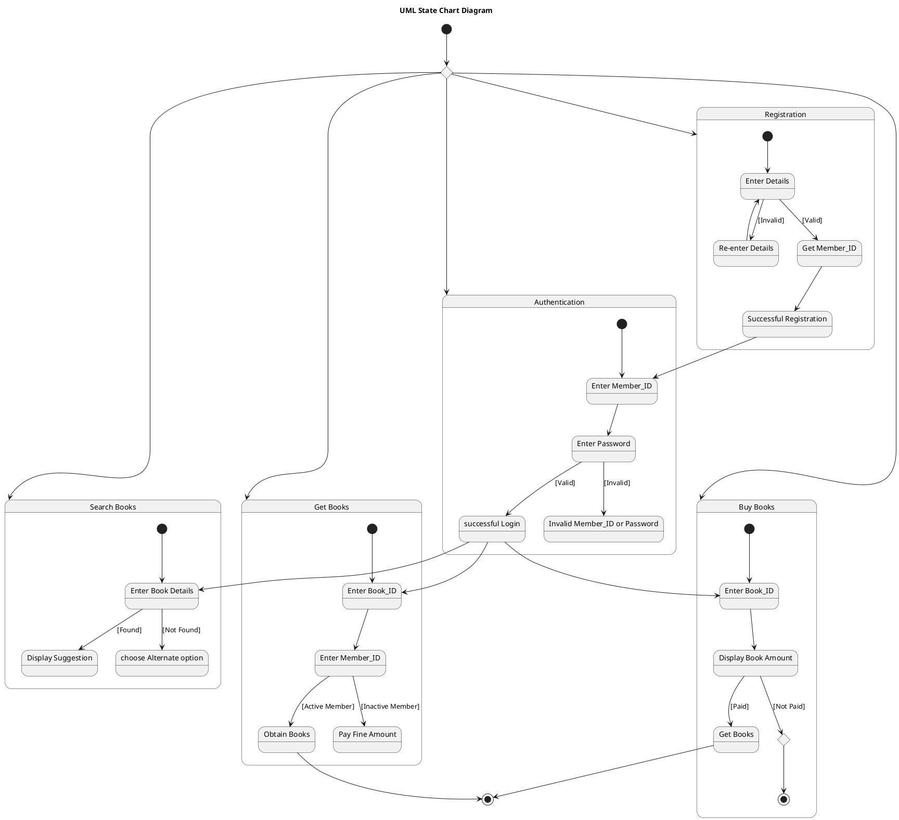

# Book Bank Management System — Polished Requirement Specification

## Requirement

Book Bank Management System — Polished Requirement Specification

Functional Requirements
1. The system shall allow a user to register by entering their details.
2. The system shall issue a member ID and complete the registration upon correct entry of details.
3. The system shall require the user to re-enter their details upon incorrect entry of details.
4. The system shall allow a user to log in after successful registration using their member ID and password.
5. The system shall allow the user to continue upon correct entry of member ID and password during login. Otherwise, they cannot log in.
6. The system shall allow a user to search for a book by entering its details.
7. The system shall show suggestions if a book is found during a search; otherwise, it shall allow the user to choose another option.
8. The system shall allow a user to get a book by entering its ID and their member ID.
9. The system shall allow the user to get the book if their membership is active; otherwise, it shall require them to pay the fine amount first.
10. The system shall allow a user to buy a book by entering its ID and seeing the price.
11. The system shall provide the book if the user pays; otherwise, it shall end the process there.

## Reference PlantUML

