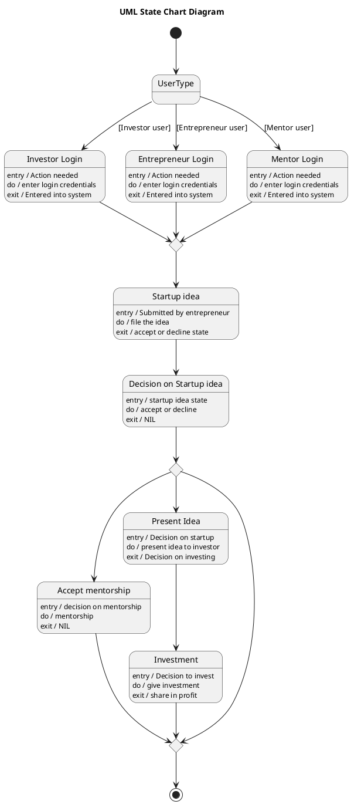

# Startup Meet — Polished Requirement Specification

## Requirement

Startup Meet — Polished Requirement Specification

Functional Requirements
1. The system shall allow the user to select their roll (investor, entrepreneur, or mentor).
2. The system shall enable the user to sign in after choosing a role.
3. The system shall allow the signed-in user to submit a startup idea.
4. The system shall review the submitted startup idea.
5. The system shall provide mentorship based on the review result.
6. The system shall make an investment decision if the startup idea is presented to an investor.
7. The system shall provide funding based on the investment decision.
8. The system shall end the process once all actions are completed.

## Reference PlantUML

