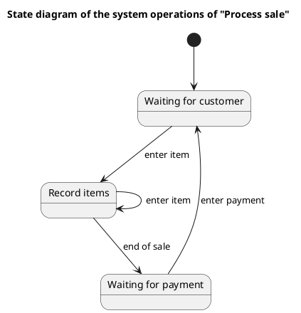

# Cash Register — Polished Requirement Specification

## Requirement

Cash Register — Polished Requirement Specification

Functional Requirements
1. The system shall wait for a customer.
2. The system shall add items one by one when a customer begins a purchase.
3. The system shall wait for payment after all items are added.
4. The system shall go back to waiting for the next customer after the payment is made.

## Reference PlantUML

