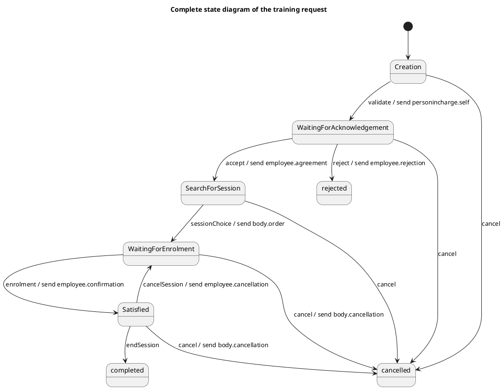

# Information System — Polished Requirement Specification

## Requirement

Information System — Polished Requirement Specification

Functional Requirements
1. The system shall start a training request upon creation.
2. The system shall send the request for approval after its creation.
3. The system shall end the process if the request is rejected.
4. The system shall look for a suitable session if the request is accepted.
5. The system shall perform enrolment once a session is chosen.
6. The system shall satisfy the request if enrolment is confirmed.
7. The system shall allow completion of the session after enrolment confirmation.
8. The system shall allow cancellation of a selected session and selection of a new one.
9. The system shall end the process if the request is cancelled at any point before completion.

## Reference PlantUML

