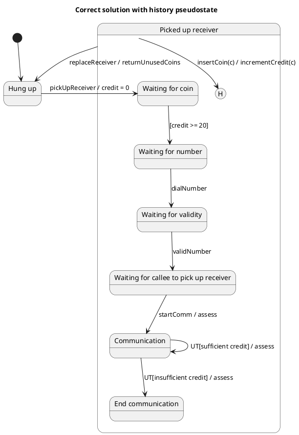

# Coin Operated Pay Phone — Polished Requirement Specification

## Requirement

Coin Operated Pay Phone — Polished Requirement Specification

Functional Requirements
1. The system shall start when it is not in use.
2. The system shall require inserting coins when the user picks up the receiver.
3. The system shall allow dialing a number only after sufficient credit has been added.
4. The system shall start the call when the dialed number is valid and the other party answers.
5. The system shall continue the call as long as there is sufficient credit.
6. The system shall end the call if the credit runs out during the call.
7. The system shall allow adding more coins to continue the call.
8. The system shall return any unused coins when the user hangs up.
9. The system shall return to an unused state after a call ends.

## Reference PlantUML

