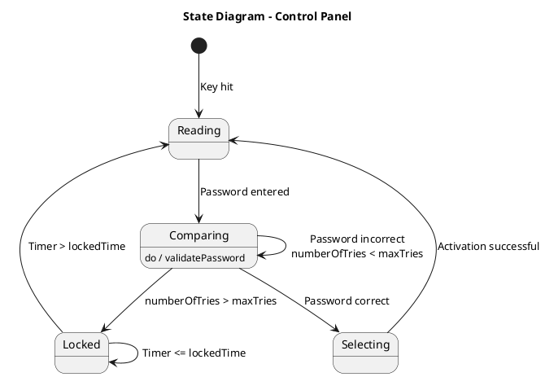

# Controlpanel Class — Polished Requirement Specification

## Requirement

Controlpanel Class — Polished Requirement Specification

Functional Requirements
1. The system shall check the entered password.
2. The system shall allow the user to continue making selections if the password is correct.
3. The system shall limit the number of incorrect password attempts a user can make.
4. The system shall lock and not allow further access for a certain period after too many incorrect attempts.
5. The system shall allow users to try accessing again after the lockout period has passed.

## Reference PlantUML

