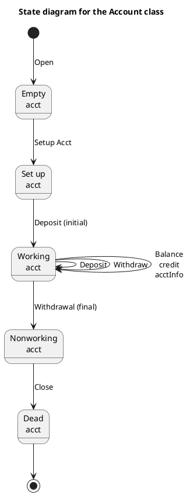

# Account — Polished Requirement Specification

## Requirement

Account — Polished Requirement Specification

Functional Requirements
1. The system shall start an account as empty when it is first opened.
2. The system shall activate an account and make it ready to use after setting it up and making an initial deposit.
3. The system shall allow a user to deposit money while the account is active.
4. The system shall allow a user to withdraw money while the account is active.
5. The system shall allow a user to check account details like balance while the account is active.
6. The system shall make an account inactive if all the money is withdrawn.
7. The system shall allow closing an account after it has become inactive.
8. The system shall render an account unusable once it is closed.

## Reference PlantUML

