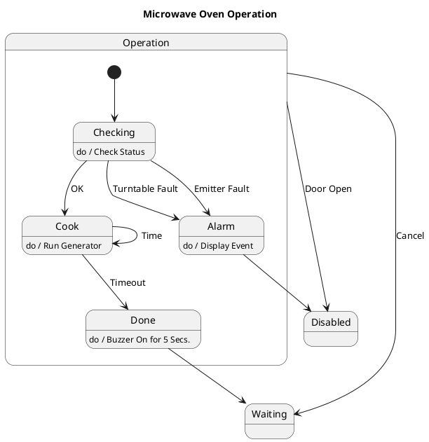

# Microwave Oven Operation — Polished Requirement Specification

## Requirement

Microwave Oven Operation — Polished Requirement Specification

Functional Requirements
1. The system shall check for proper functioning before starting.
2. The system shall alert the user and stop operation if an issue is detected.
3. The system shall start cooking and run for the set time if no issues are detected.
4. The system shall emit a sound to notify the user upon completion of cooking.
5. The system shall stop operation and deactivate if the door is opened.
6. The system shall return to a waiting state if the user cancels the operation.

## Reference PlantUML

