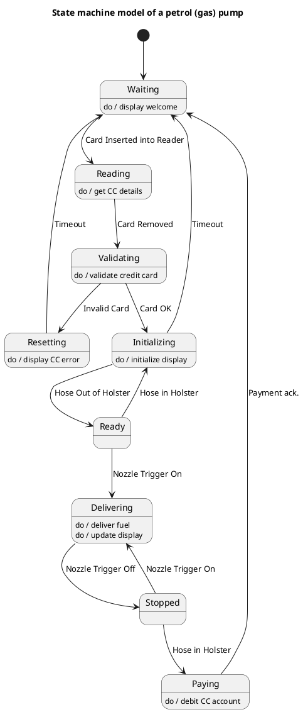

# Petrol Gas Pump — Polished Requirement Specification

## Requirement

Petrol Gas Pump — Polished Requirement Specification

Functional Requirements
1. The system shall display a welcome message when not in use.
2. The system shall read the card details upon card insertion.
3. The system shall prepare the pump for use if the card is valid.
4. The system shall show an error message and reset if the card is invalid.
5. The system shall start fuel delivery when the nozzle is lifted during fueling.
6. The system shall stop fuel delivery when the nozzle is released.
7. The system shall process payment and deduct the amount from the account after fueling.
8. The system shall return to its initial state after completing a transaction.
9. The system shall automatically reset if there is inactivity for too long.

## Reference PlantUML

