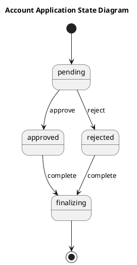

# Accountapplication — Polished Requirement Specification

## Requirement

Accountapplication — Polished Requirement Specification

Functional Requirements
1. The system shall store an application in a pending state during review.
2. The system shall update the application status to either approved or rejected after review.
3. The system shall finalize the application process once a decision is made.
4. The system shall mark every application as finalized upon process completion.

## Reference PlantUML

