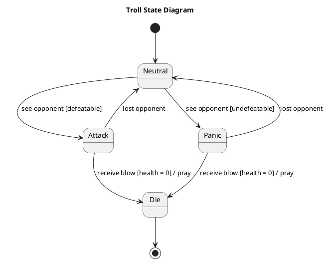

# First Person Shooter Fps Games — Polished Requirement Specification

## Requirement

First Person Shooter Fps Games — Polished Requirement Specification

Functional Requirements
1. The system shall keep the troll in a calm state with no actions if there is no detected threat.
2. The system shall determine the troll's reaction based on the perceived strength of the detected opponent.
3. The system shall make the troll aggressive and start an attack if the opponent appears weak enough to defeat.
4. The system shall continue the troll's fight while it can see the opponent.
5. The system shall calm the troll and return it to a normal state if it loses sight of the opponent.
6. The system shall make the troll scared and panic if the opponent appears too strong.
7. The system shall calm the troll and return it to a normal state if it gets away from or loses sight of a stronger opponent.
8. The system shall remove the troll from the game if it takes a fatal hit and its health reaches zero.

## Reference PlantUML

