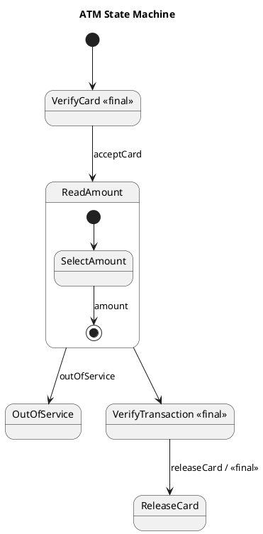

# Atm Scenario 3 — Polished Requirement Specification

## Requirement

Atm Scenario 3 — Polished Requirement Specification

Functional Requirements
1. The system shall check if the inserted card is valid.
2. The system shall prompt the user to select an amount to withdraw if the card is valid.
3. The system shall verify the transaction after the user selects an amount.
4. The system shall return the card to the user once the transaction is completed.
5. The system shall go out of service and not allow any operation if the machine is not working.

## Reference PlantUML

