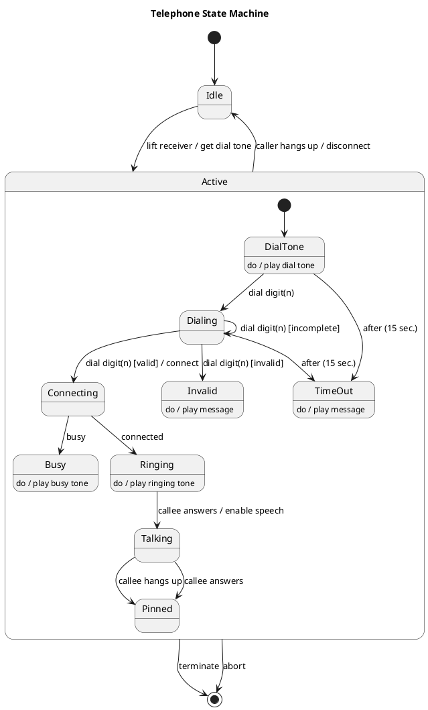

# Telephone — Polished Requirement Specification

## Requirement

Telephone — Polished Requirement Specification

Functional Requirements
1. The system shall provide a dial tone upon receiver pickup.
2. The system shall start processing the entered number when the user begins entering digits.
3. The system shall inform the user or play a message if the entered number is incomplete or incorrect.
4. The system shall play a message to prompt the user if they stop dialing for a while.
5. The system shall attempt to connect the call once a valid number is entered.
6. The system shall play a busy tone if the line is busy.
7. The system shall start ringing on the other end if the connection goes through.
8. The system shall connect the call and allow both parties to talk when the person being called answers.
9. The system shall end the call and return to an idle state if either party hangs up.
10. The system shall allow calls to be stopped or terminated at any point.

## Reference PlantUML

