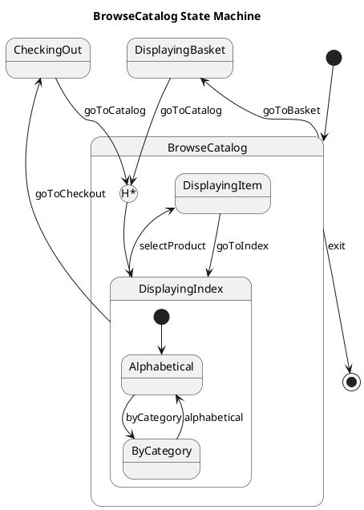

# Displayitem — Polished Requirement Specification

## Requirement

Displayitem — Polished Requirement Specification

Functional Requirements
1. The system shall allow users to browse products through a catalog.
2. The system shall enable users to view items directly or explore different ways of browsing in the catalog.
3. The system shall allow users to browse products using an index, either alphabetically or by category.
4. The system shall enable users to switch between browsing options based on their preferences.
5. The system shall allow users to select a product once they find one of interest to view its details.
6. The system shall enable users to review the items in their basket at any time.
7. The system shall allow users from the basket to either return to the catalog or proceed to checkout.
8. The system shall enable users to review their selections during checkout and proceed with the purchase.
9. The system shall allow users to return to the catalog from the checkout page to make changes before completing the process.

## Reference PlantUML

