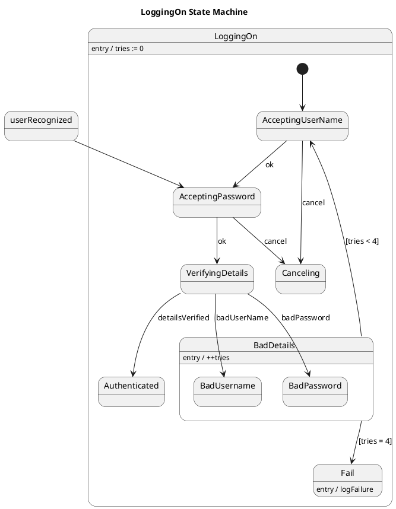

# Loggedin Mechanism — Polished Requirement Specification

## Requirement

Loggedin Mechanism — Polished Requirement Specification

Functional Requirements
1. The system shall prompt the user to enter their username.
2. The system shall terminate the login process and exit if the user cancels at any point.
3. The system shall check the entered username against its records.
4. The system shall prompt for a password if the username is valid.
5. The system shall verify both the username and password to allow login.
6. The system shall allow the user to try again if the credentials are incorrect.
7. The system shall increase the number of failed attempts with each incorrect entry.
8. The system shall limit the number of login attempts for a user.
9. The system shall block further login attempts if the maximum number of attempts is reached.
10. The system shall prevent login if it cannot recognize the user during any step.

## Reference PlantUML

