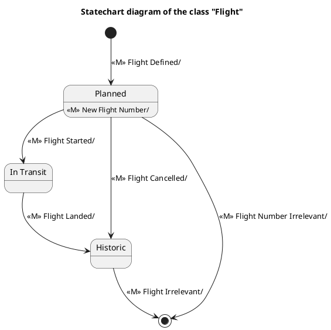

# Flight — Polished Requirement Specification

## Requirement

Flight — Polished Requirement Specification

Functional Requirements
1. The system shall schedule and assign a flight number when a new flight is created.
2. The system shall change the flight status to 'on journey' once it takes off.
3. The system shall mark the flight as inactive and record it as a past record upon landing.
4. The system shall record cancelled flights in the same manner as landed flights if they are cancelled before starting.
5. The system shall remove inactive flights over time.

## Reference PlantUML

