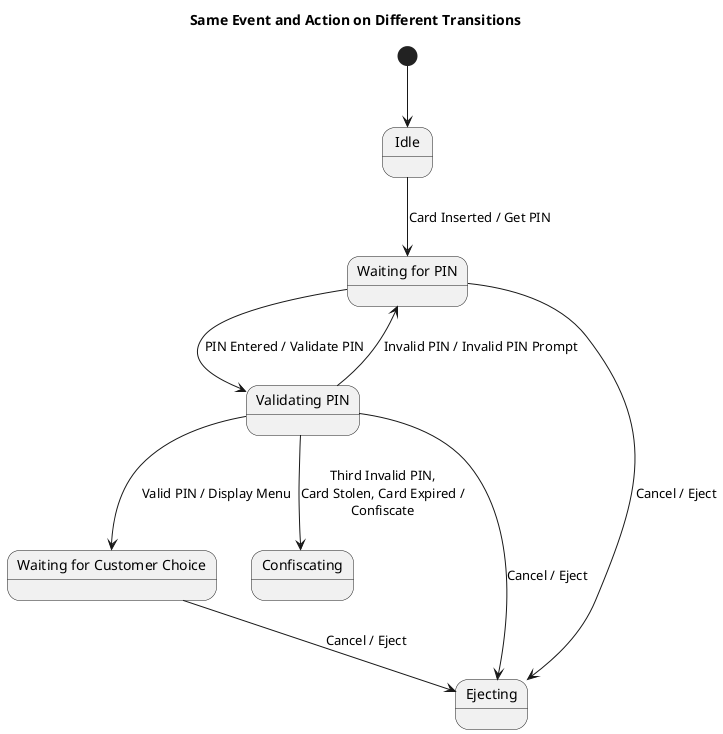

# Atm Many Scenarios Scenario 3 — Polished Requirement Specification

## Requirement

Atm Many Scenarios Scenario 3 — Polished Requirement Specification

Functional Requirements
1. The system shall check if the entered PIN is correct.
2. The system shall ask the user to try again if the entered PIN is incorrect.
3. The system shall keep the card for security reasons if the PIN is entered incorrectly too many times or if the card is invalid.
4. The system shall show available options and wait for the user's choice if the entered PIN is correct.
5. The system shall allow the user to cancel the operation at any point during this process.
6. The system shall return the card when the user cancels the operation.

## Reference PlantUML

