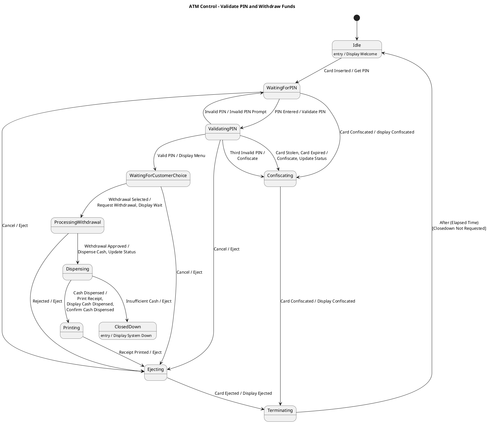

# Atm Many Scenarios Scenario 6 — Polished Requirement Specification

## Requirement

Atm Many Scenarios Scenario 6 — Polished Requirement Specification

Functional Requirements
1. The system shall check if the entered PIN is correct.
2. The system shall ask for the PIN again if it is incorrect.
3. The system shall keep the card for security reasons if the user keeps entering an incorrect PIN or if the card is invalid.
4. The system shall return the card if the user cancels the process at any moment during this stage.
5. The system shall display options for the user to choose from if the PIN is correct.
6. The system shall process the withdrawal request and check if it can approve the transaction.
7. The system shall cancel everything and return the card if the withdrawal request is rejected.
8. The system shall dispense cash, print a receipt, and return the card if the withdrawal request is approved.
9. The system shall stop the operation if it runs out of cash during the process.
10. The system shall reset itself to be ready for the next user after completing or ending the session.

## Reference PlantUML

