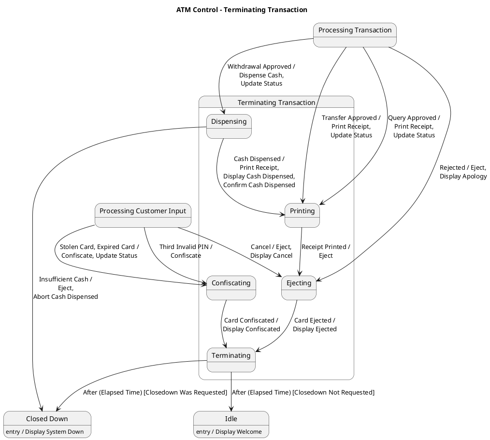

# Atm Many Scenarios Scenario 8 — Polished Requirement Specification

## Requirement

Atm Many Scenarios Scenario 8 — Polished Requirement Specification

Functional Requirements
1. The system shall keep the card if it is invalid, expired, or the PIN was entered incorrectly too many times.
2. The system shall return the card with a message if the user cancels the operation or the request is rejected.
3. The system shall print a receipt and dispense cash if needed before returning the card to the user after a successful transaction.
4. The system shall consider the session finished once the card is ejected.
5. The system shall move into a short ending phase before resetting itself after completing the transaction or cancellation process.
6. The system shall return to its normal waiting condition or shut down depending on the situation.

## Reference PlantUML

