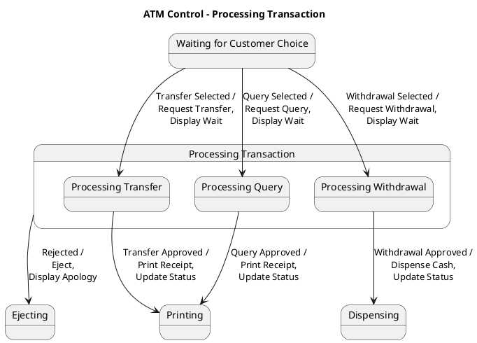

# Atm Many Scenarios Scenario 9 — Polished Requirement Specification

## Requirement

Atm Many Scenarios Scenario 9 — Polished Requirement Specification

Functional Requirements
1. The system shall allow the user to choose to transfer money after entering the correct PIN.
2. The system shall process the transfer request if it is approved.
3. The system shall print a receipt for approved transfers and queries.
4. The system shall allow the user to choose to check information after entering the correct PIN.
5. The system shall print a receipt for transfers and queries.
6. The system shall process the query request if it is approved.
7. The system shall allow the user to choose to withdraw cash after entering the correct PIN.
8. The system shall process the withdrawal request and dispense cash if it is approved.
9. The system shall cancel the operation, show a message, and return the card if the request is rejected.

## Reference PlantUML

