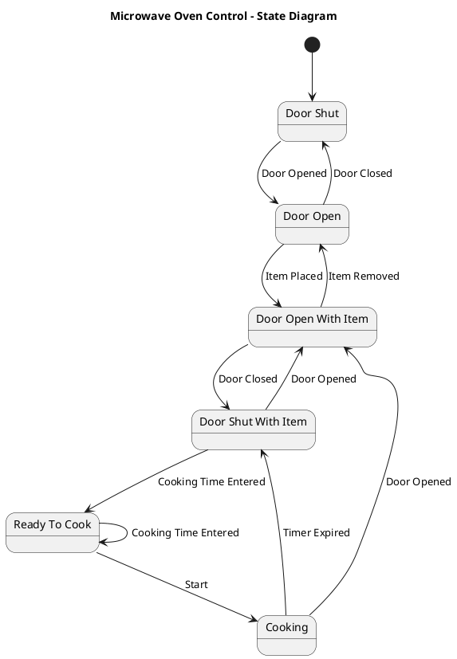

# Oven — Polished Requirement Specification

## Requirement

Oven — Polished Requirement Specification

Functional Requirements
1. The system shall allow the user to open the door whenever it is closed.
2. The system shall allow the user to place food inside or remove it from the microwave when the door is open.
3. The system shall require the user to close the door after placing food inside.
4. The system shall require the user to enter cooking time after the door is closed.
5. The system shall start cooking the food when the user initiates the microwave and continue until the set time is completed.
6. The system shall stop immediately if the door is opened during cooking for safety reasons.
7. The system shall stop when the cooking time ends and allow the user to open the door to remove the food.

## Reference PlantUML

