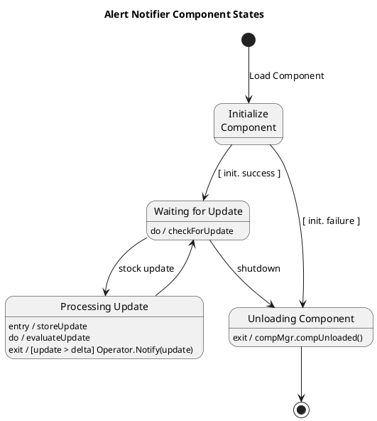

# Alert Notifier — Polished Requirement Specification

## Requirement

Alert Notifier — Polished Requirement Specification

Functional Requirements
1. The system shall initialize a component to detect updates upon initial loading.
2. The system shall enter a waiting mode and continuously check for incoming updates if initialization is successful.
3. The system shall process detected updates by storing them and evaluating their significance.
4. The system shall notify appropriate operators of changes based on evaluation results if certain conditions are met.
5. The system shall return to a waiting state after processing an update.
6. The system shall enter an unloading phase if initialization fails or if the system is shut down while the component is running.
7. The system shall perform necessary cleanup operations and inform the component manager of successful removal during unloading.
8. The system shall terminate the component's operation after unloading is complete.

## Reference PlantUML

