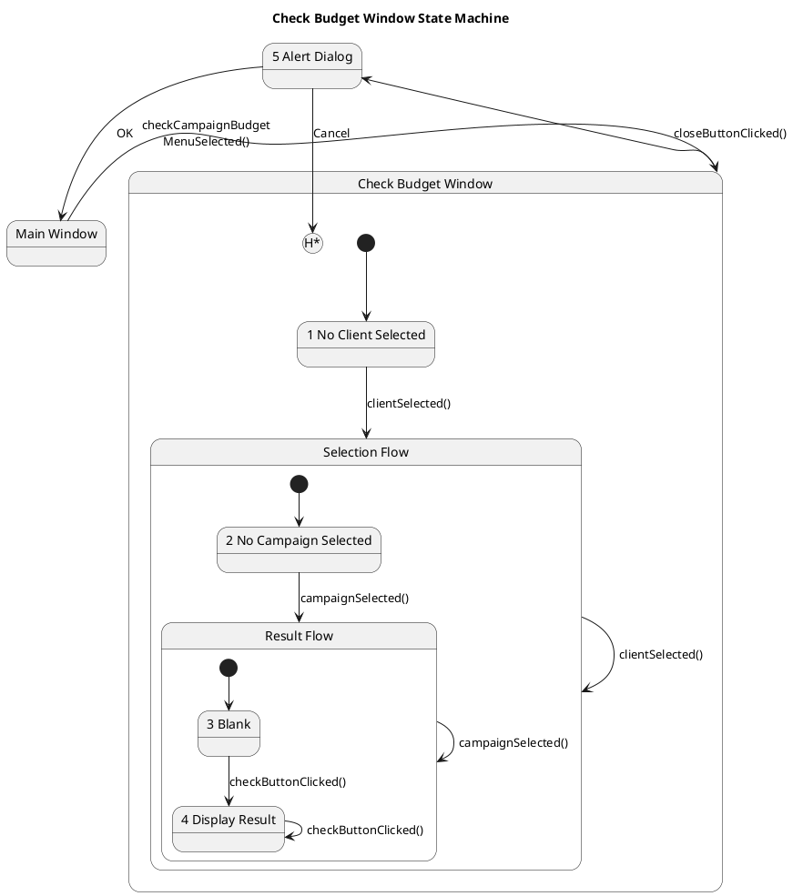

# Ui — Polished Requirement Specification

## Requirement

Ui — Polished Requirement Specification

Functional Requirements
1. The system shall allow users to open a budget-checking window from the main screen.
2. The system shall wait for the user to select a client before proceeding with the checking process.
3. The system shall require users to select a campaign related to the chosen client before allowing them to check information.
4. The system shall display results only after both a client and a campaign are selected.
5. The system shall allow users to refresh or recheck information by pressing the check button again.
6. The system shall prompt users with a confirmation message before closing the window.
7. The system shall return to the main screen if the user confirms closing the window.
8. The system shall keep the window open and allow further interaction if the user cancels the close action.

## Reference PlantUML

