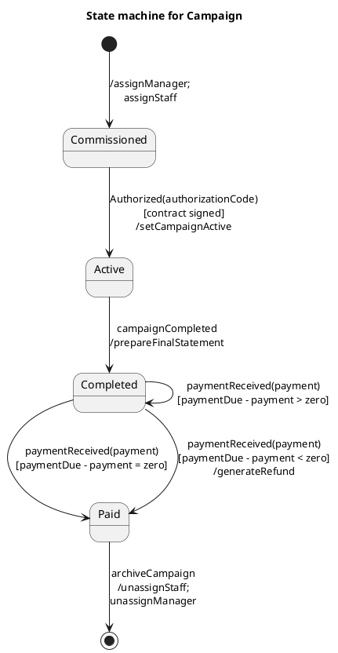

# Class Campaign — Polished Requirement Specification

## Requirement

Class Campaign — Polished Requirement Specification

Functional Requirements
1. The system shall begin a campaign once a manager and staff are assigned.
2. The system shall activate and start running a campaign upon approval and signing of the contract.
3. The system shall prepare a final statement when the campaign is finished and move the process toward completion.
4. The system shall handle payment after the final statement is prepared.
5. The system shall generate a refund if the payment is less than what is due.
6. The system shall wait for the correct amount to be settled if the payment exceeds the due amount.
7. The system shall mark the campaign as fully paid when the payment matches exactly.
8. The system shall archive the campaign and release the assigned staff and manager after everything is settled.

## Reference PlantUML

