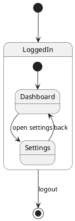

# PlantUML Composite States and Pseudostates

Use this document when the requirement contains nested behavior, decisions, history, branching, or concurrent regions.

## Composite states

A composite state is declared with `state Name { ... }`.



## Nested substates

Nested states may be declared inside a composite state.

```plantuml
state Parent {
  state ChildA
  state ChildB
  ChildA --> ChildB
}
```

## Substate-to-substate transitions

Transitions between substates are allowed.

```plantuml
state A {
  [*] --> X
  X --> Y : next
}
```

## History states

Use `[H]` for shallow history and `[H*]` for deep history.

```plantuml
state Session {
  [*] --> Browsing
  Browsing --> Checkout
}

Session --> Session[H] : resume
Session --> Session[H*] : deep resume
```

## Choice nodes

Use the `<<choice>>` stereotype for conditional branches.

```plantuml
state Decision <<choice>>

[*] --> Decision
Decision --> Approved : [valid]
Decision --> Rejected : [invalid]
Approved --> [*]
Rejected --> [*]
```

## Fork and join

Use `<<fork>>` and `<<join>>` when behavior splits into parallel branches and later joins.

```plantuml
state fork1 <<fork>>
state join1 <<join>>

[*] --> fork1
fork1 --> TaskA
fork1 --> TaskB
TaskA --> join1
TaskB --> join1
join1 --> [*]
```

## Concurrent regions

Inside a composite state, use `--` for horizontal regions or `||` for vertical regions.

```plantuml
state Active {
  [*] --> RegionA
  RegionA --> DoneA

--

  [*] --> RegionB
  RegionB --> DoneB
}
```
