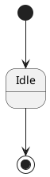
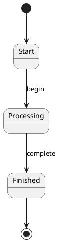

# PlantUML State Diagram Core Syntax

Use this document when generating a basic UML state transition diagram in PlantUML.

## Diagram wrapper

PlantUML code should be enclosed between `@startuml` and `@enduml`.



## Initial and final state

The initial and final pseudostate is written as `[*]`.

Initial transition:

```plantuml
[*] --> State1
```

Final transition:

```plantuml
State1 --> [*]
```

## Transitions

Use arrows between states.

```plantuml
State1 --> State2
State1 -> State2
```

Transitions can include labels after a colon.

```plantuml
Idle --> LoggedIn : login successful
LoggedIn --> LoggedOut : logout
```

Labels may include event, guard, and action information.

```plantuml
Checking --> Approved : [valid] / approve request
Checking --> Rejected : [invalid] / reject request
```

## State declarations

States can be declared explicitly.

```plantuml
state Idle
state Processing
```

States can also be created implicitly by transitions.

```plantuml
Idle --> Processing
```

## State behavior descriptions

A state may include behavior lines.

```plantuml
State1 : entry / initialize
State1 : do / process request
State1 : exit / save result
```

Simple descriptions are also allowed.

```plantuml
State1 : user waits for system response
```

## Minimal valid state diagram pattern


