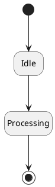

# PlantUML Optional State Diagram Rendering and Style

Use this document only when visual styling is requested. For normal generation, prioritize correct state and transition syntax over styling.

## Hide empty descriptions

Use `hide empty description` to render states as simple boxes when they have no internal text.



## Inline color

Individual states may include inline color.

```plantuml
state CurrentSite #pink {
  [*] --> Loading
  Loading --> Ready
}
```

## Skin parameters

`skinparam` can control drawing style, colors, and fonts.

```plantuml
skinparam state {
  BackgroundColor LightYellow
  BorderColor Black
}
```

## Practical rule for this project

For generated diagrams in this project, avoid unnecessary styling unless explicitly requested. The main goal is valid PlantUML state diagram syntax.
